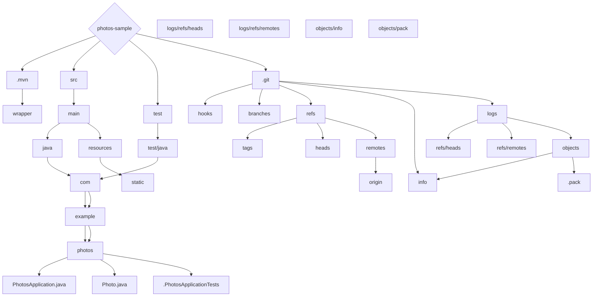

# 基础信息

|      |      |
|------|------|
| 编码语言 | .java |
| 代码路径 | photos-sample |
| 概述说明 | 一个使用@SpringBootApplication注解的Java类，名为PhotosApplication，用于运行Spring应用程序。它包含一个名为Photo的类，有id、fileName、contentType和fileContent等属性，以及与这些属性相关的getter和setter方法。另外，还有一个@SpringBootTest注解的测试类PhotosApplicationTests，其中包含一个测试方法contextLoads()。 |

# 说明

PhotosApplication是一个Java类，使用@SpringBootApplication注解进行注解。该类具有一个静态main方法，用于运行Spring应用程序。该类表示提供了一个名为Photo的类，该类具有id、fileName、contentType和fileContent等属性。另外，该类还提供了与这些属性相关的getter和setter方法。

PhotosApplicationTests类被注解为@SpringBootTest，表示它是一个Spring Boot的测试类。该类中有一个测试方法contextLoads()，用于测试Spring应用程序的上下文加载是否正常。

### 包内部结构视图

这是一个文件和文件夹的层级关系图，描述了提供信息中的文件和文件夹之间的层级关系。图中的每个节点表示一个文件或文件夹，在节点之间使用箭头 `-->` 表示层级关系。图中没有显示文件或文件夹的完整路径，只显示每个路径中的最后一级元素。通过该图，可以清晰地了解到提供信息中的文件和文件夹的层级关系。

