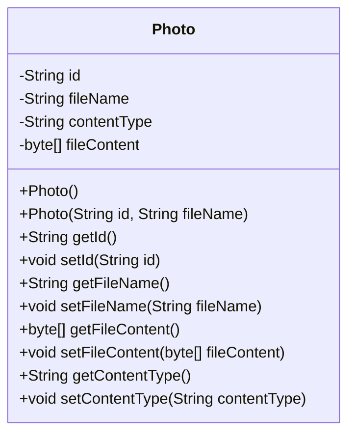

# 基础信息

|      |      |
|------|------|
| 编码语言 | .java |
| 代码路径 | photos-sample/src/main/java/com/example/photos/Photo.java |
| 包名 | com.example.photos |
| 依赖项 | [] |
| 概述说明 | Photo类包含id、fileName、contentType和fileContent等属性，提供了相应的getter和setter方法。 |

# 说明

这个信息表示提供了一个名为Photo的类，该类有id、fileName、contentType和fileContent等属性。此外，该类还提供了与这些属性相关的getter和setter方法。

# 类列表 Class Summary

| 名称   | 类型  | 说明 |
|-------|------|-------------|
| Photo | class | Photo类包含id、fileName、contentType和fileContent等属性，提供了相应的getter和setter方法。 |

## 类 Photo

|      |      |
|------|------|
| 访问范围 | public |
| 类型 | class |
| 名称 | Photo |
| 说明 | Photo类包含id、fileName、contentType和fileContent等属性，提供了相应的getter和setter方法。 |

### UML类图

该类图描述了一个名为Photo的类。该类有四个私有属性，分别是id、fileName、contentType和fileContent。该类有两个构造方法，一个是无参构造方法，另一个是带有id和fileName参数的构造方法。该类还有一系列的getter和setter方法分别用于获取和设置属性值。类图符合Mermaid的classDiagram语法规范，实现了类与类之间的关联关系。

### 内部方法调用关系图

graph TD;
    Photo --> Photo()
    Photo --> Photo(String, String)
    Photo --> getId()
    Photo --> setId(String)
    Photo --> getFileName()
    Photo --> setFileName(String)
    Photo --> getFileContent()
    Photo --> setFileContent(byte[])
    Photo --> getContentType()
    Photo --> setContentType(String)

类Photo包含以下函数调用关系：Photo构造函数调用了getter和setter函数，分别用于设置和获取照片的id、文件名、文件内容和内容类型。构造函数可以通过传递id和文件名来创建Photo对象。通过getter和setter函数，可以分别获取和设置照片的id、文件名、文件内容和内容类型。以上函数之间没有任何其他调用关系。总体而言，Photo类提供了一些基本的功能来处理照片对象的属性。

### 字段列表 Field List

| 名称  | 类型  | 说明 |
|-------|-------|------|
| contentType | String | 信息提供了一个关于内容类型的私有字符串变量。 |
| fileName | String | 该信息提供了一个私有字符串变量fileName。 |
| id | String | 提炼总结：提供的信息为一个私有字符串变量id。 |
| fileContent | byte[] | 提炼总结：
该信息包含了私有的文件内容的字节数组。 |

### 方法列表 Method List

| 名称  | 类型  | 说明 |
|-------|-------|------|
| setContentType | void | 设置内容类型的公共方法。 |
| getFileName | String | 返回文件名。 |
| setFileName | void | 设置文件名方法：public void setFileName(String fileName) |
| setFileContent | void | 设置文件内容的方法，接收一个字节数组作为参数。 |
| getFileContent | byte[] | 提供了一个方法getFileContent()，该方法返回一个byte数组，即文件的内容。 |
| getContentType | String | 该代码片段是一个Java方法的实现，用于获取内容的类型。该方法返回一个字符串类型的内容类型。 |
| getId | String | 该代码片段是一个Java方法，名为getId()，返回一个类型为String的公共变量id。 |
| setId | void | 提供的信息是一个Java代码片段，其中包含了一个名为"setId"的公共方法，该方法用于设置一个名为"id"的属性。这个属性可以用于标识一个对象。 |

