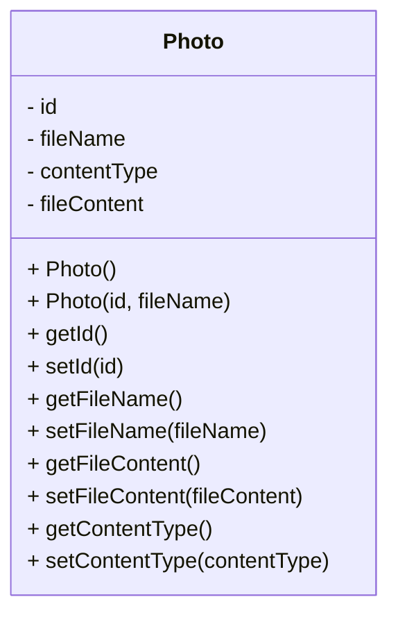

# 基础信息

|      |      |
|------|------|
| 编码语言 | .java |
| 代码路径 | photos-sample/src/main/java/com/example/photos/Photo.java |
| 包名 | com.example.photos |
| 依赖项 | [] |
| 概述说明 | 概要说明：Photo类包含照片ID、文件名、内容类型和文件内容。 |

# 说明

这个名为"Photo"的公共类包含以下关键点和重要信息：

- id：照片的唯一标识符，用于标识照片的ID。
- fileName：照片的文件名，用于指定照片的文件名。
- contentType：照片的内容类型，用来确定照片文件的MIME类型。
- fileContent：照片的文件内容，是照片的二进制数据。

这个类的目的是为了方便管理和操作照片文件。通过使用该类，可以轻松地获取照片的ID、文件名、内容类型和文件内容。

该类对于存储和处理照片文件非常有用。可以使用照片的ID来识别和检索特定的照片。文件名可以帮助用户更好地理解和识别照片的内容。内容类型可以用于确定照片文件的类型，例如图像、视频等。文件内容包含了照片的实际数据，可以使用这些数据进行各种操作，例如展示、编辑或存储。

总之，这个名为"Photo"的公共类提供了管理照片文件的便捷方式，包括照片的ID、文件名、内容类型和文件内容的操作。它是一个有用的工具，可以帮助用户更好地了解和处理照片文件。

# 类列表 Class Summary

| 名称   | 类型  | 说明 |
|-------|------|-------------|
| Photo | class | 该信息描述了一个名为"Photo"的公共类，包含了以下关键点和重要信息：id（照片ID）、fileName（文件名）、contentType（内容类型）和fileContent（文件内容）。 |

## 类 Photo

|      |      |
|------|------|
| 访问范围 | public |
| 类型 | class |
| 名称 | Photo |
| 说明 | 该信息描述了一个名为"Photo"的公共类，包含了以下关键点和重要信息：id（照片ID）、fileName（文件名）、contentType（内容类型）和fileContent（文件内容）。 |

### UML类图

```mermaid
classDiagram
class Photo {
- id
- fileName
- contentType
- fileContent
+ Photo()
+ Photo(id, fileName)
+ getId()
+ setId(id)
+ getFileName()
+ setFileName(fileName)
+ getFileContent()
+ setFileContent(fileContent)
+ getContentType()
+ setContentType(contentType)
}
```

描述：这个类图代表了一个名为Photo的类，该类具有私有的id、fileName、contentType和fileContent属性。类中包含了默认构造函数和带参数的构造函数，以及获取和设置属性的方法。

### 内部方法调用关系图

graph TD;
constructor-->setId;
constructor-->setFileName;
getFileContent-->fileContent;
setFileContent-->fileContent;
getFileName-->fileName;
setFileName-->fileName;
getId-->id;
setId-->id;
getContentType-->contentType;
setContentType-->contentType;
setId-->id;
setFileName-->fileName;
setContentType-->contentType;
setFileContent-->fileContent;
给定的编码描述了一个名为Photo的类，它包含了一些用于处理照片信息的方法。它有两个构造函数，一个带有id和fileName两个参数，另一个没有参数。id和fileName属性有对应的get和set方法，用于获取和设置属性的值。getFileContent和setFileContent方法用于获取和设置照片的文件内容。getContentType和setContentType方法用于获取和设置照片的内容类型。在构造函数中，setId和setFileName方法分别用于设置Photo对象的id和fileName属性的值。setContentType和setFileContent方法用于设置Photo对象的contentType和fileContent属性的值。

### 字段列表 Field List

| 名称  | 类型  | 说明 |
|-------|-------|------|
| contentType | String | contentType是一个私有变量。 |
| fileName | String | 该信息提供了一个私有变量fileName。 |
| fileContent | byte[] | 提供了一个文件内容的私有字节数组。 |
| id | String | 生成一个不超过100字的概要说明的关键点和重要信息应该如下所示：
- 输入的信息是一个私有的字符串id。
- 该信息需要进行处理或处理后返回。 |

### 方法列表 Method List

| 名称  | 类型  | 说明 |
|-------|-------|------|
| setFileName | void | 设置文件名的方法。 |
| getContentType | String | 返回contentType类型的方法。 |
| setContentType | void | 方法setContentType用于设置contentType的值。 |
| setId | void | 设置ID的公共方法。 |
| getFileContent | byte[] | 获取文件内容的方法是通过调用getFileContent()函数来返回一个字节数组。 |
| getFileName | String | 获取文件名的方法是通过调用getFileName()函数来实现的，该方法返回一个字符串。 |
| getId | String | 提供的信息是一个代码片段，其中包含一个公共方法getId()，该方法返回一个名为id的字符串。 |
| setFileContent | void | 提供的信息是一个名为setFileContent的公共方法，它接受一个名为fileContent的字节数组作为参数，并将其赋值给类的fileContent属性。 |

