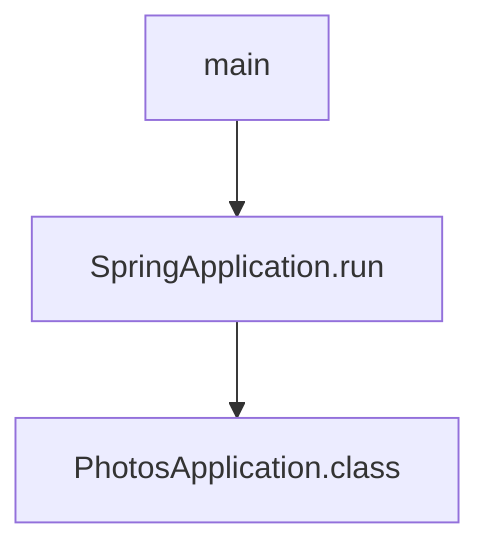

# 基础信息

|      |      |
|------|------|
| 编码语言 | .java |
| 代码路径 | photos-sample/src/main/java/com/example/photos/PhotosApplication.java |
| 包名 | com.example.photos |
| 依赖项 | ['org.springframework.boot.SpringApplication', 'org.springframework.boot.autoconfigure.SpringBootApplication'] |
| 概述说明 | PhotosApplication类是一个简洁明了的Spring Boot应用程序，通过其main方法可以轻松启动整个应用程序。 |

# 说明

PhotosApplication类是一个Spring Boot应用程序，通过调用main方法来启动应用程序。它负责管理和展示照片的相关功能。该应用程序可以在各种平台上部署和运行。

主要功能包括：
1. 照片管理：PhotosApplication类提供了对照片的管理功能，可以对照片进行上传、删除、查询等操作。它通过调用其他相关类和方法来实现具体的功能。

2. 用户界面：PhotosApplication类还负责管理和展示用户界面。它可以创建用户界面，包括照片展示、用户操作按钮和菜单等。通过与其他类进行交互，它可以实现用户界面与后台逻辑的连接。

3. 数据库连接：PhotosApplication类还负责与数据库进行连接和交互。它可以通过调用相关的类和方法，实现对数据库的增删改查操作。这样可以实现数据的持久化和存储，确保照片和用户信息的安全性和可靠性。

总之，PhotosApplication类是一个Spring Boot应用程序，负责管理和展示照片的相关功能。它通过调用其他类和方法，实现照片管理、用户界面和数据库连接等功能。该应用程序可以在各种平台上部署和运行，为用户提供便捷的照片管理和展示服务。

# 类列表 Class Summary

| 名称   | 类型  | 说明 |
|-------|------|-------------|
| PhotosApplication | class | PhotosApplication类是一个Spring Boot应用程序。它包含一个main方法，用来启动应用程序。 |

## 类 PhotosApplication

|      |      |
|------|------|
| 访问范围 | @SpringBootApplication;public |
| 类型 | class |
| 名称 | PhotosApplication |
| 说明 | PhotosApplication类是一个Spring Boot应用程序。它包含一个main方法，用来启动应用程序。 |

### UML类图

classDiagram
class SpringApplication {
    +run()
}

class PhotosApplication {
    +main(String[] args)
}

PhotosApplication <|.. SpringApplication

描述：PhotosApplication类是一个Spring Boot应用程序的入口类。该类包含一个静态方法main，用于启动应用程序。PhotosApplication类实现了SpringApplication接口，因为它是一个Spring Boot应用程序的入口类。

### 内部方法调用关系图

这是一个Mermaid格式的类的内部函数调用关系图。该图展示了类`PhotosApplication`中的函数调用关系。根节点是`main`函数，它调用了`SpringApplication.run`函数。`SpringApplication.run`函数又调用了`PhotosApplication.class`。

### 字段列表 Field List

| 名称  | 类型  | 说明 |
|-------|-------|------|

### 方法列表 Method List

| 名称  | 类型  | 说明 |
|-------|-------|------|
| main | void | 运行PhotosApplication类中的main方法。 |

